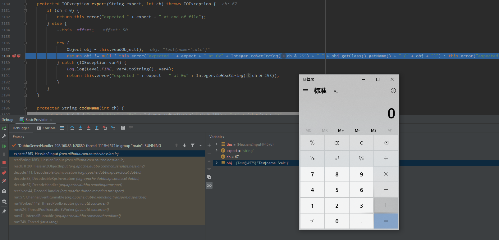

#### 漏洞描述

Dubbo Hessian-Lite 3.2.11及之前版本中存在潜在RCE攻击风险。Hessian-Lite在遇到序列化异常时会输出相关信息，这可能导致触发某些恶意定制的Bean的toString方法，从而引发RCE攻击。

#### 漏洞复现

##### 环境搭建

https://github.com/longofo/Apache-Dubbo-Hessian2-CVE-2021-43297

##### 漏洞验证

测试效果如图：



#### 漏洞分析

**报错堆栈信息**


**Source**

- com.alibaba.com.caucho.hessian.io.Hessian2Input#expect
  - 隐式调用toString()方法 -> RCE

```java
 protected IOException expect(String expect, int ch) throws IOException {
        if (ch < 0) {
            return this.error("expected " + expect + " at end of file");
        } else {
            --this._offset;

            try {
                Object obj = this.readObject();
                // 隐式调用toString()方法 -> RCE
                return obj != null ? this.error("expected " + expect + " at 0x" + Integer.toHexString(ch & 255) + " " + obj.getClass().getName() + " (" + obj + ")") : this.error("expected " + expect + " at 0x" + Integer.toHexString(ch & 255) + " null");
            } catch (IOException var4) {
                log.log(Level.FINE, var4.toString(), var4);
                return this.error("expected " + expect + " at 0x" + Integer.toHexString(ch & 255));
            }
        }
    }
```


**调用栈**

```java
expect:3563, Hessian2Input (com.alibaba.com.caucho.hessian.io)
readString:1883, Hessian2Input (com.alibaba.com.caucho.hessian.io)
readUTF:90, Hessian2ObjectInput (org.apache.dubbo.common.serialize.hessian2)
decode:111, DecodeableRpcInvocation (org.apache.dubbo.rpc.protocol.dubbo)
decode:83, DecodeableRpcInvocation (org.apache.dubbo.rpc.protocol.dubbo)
decode:57, DecodeHandler (org.apache.dubbo.remoting.transport)
received:44, DecodeHandler (org.apache.dubbo.remoting.transport)
run:57, ChannelEventRunnable (org.apache.dubbo.remoting.transport.dispatcher)
runWorker:1149, ThreadPoolExecutor (java.util.concurrent)
run:624, ThreadPoolExecutor$Worker (java.util.concurrent)
run:41, InternalRunnable (org.apache.dubbo.common.threadlocal)
run:748, Thread (java.lang)
```


**简要分析**

- com.alibaba.com.caucho.hessian.io.Hessian2Input#readString()

```java
    public String readString() throws IOException {
        int tag = this.read();
        int ch;
        switch(tag) {
        case 0:
        ...
        case 31:
            this._isLastChunk = true;
            this._chunkLength = tag - 0;
            this._sbuf.setLength(0);

            while((ch = this.parseChar()) >= 0) {
                this._sbuf.append((char)ch);
            }

            return this._sbuf.toString();
        case 32:
        ...
        case 127:
        default:
            throw this.expect("string", tag);
        case 48:
        case 49:
        case 50:
        case 51:
            this._isLastChunk = true;
            this._chunkLength = (tag - 48) * 256 + this.read();
            this._sbuf.setLength(0);

            while((ch = this.parseChar()) >= 0) {
                this._sbuf.append((char)ch);
            }

            return this._sbuf.toString();
        case 56:
        case 57:
        case 58:
        case 59:
        case 60:
        case 61:
        case 62:
        case 63:
            return String.valueOf((tag - 60 << 16) + 256 * this.read() + this.read());
        case 68:
            return String.valueOf(this.parseDouble());
        case 70:
            return "false";
        case 73:
        case 89:
            return String.valueOf(this.parseInt());
        case 76:
            return String.valueOf(this.parseLong());
        case 78:
            return null;
        case 82:
        case 83:
            this._isLastChunk = tag == 83;
            this._chunkLength = (this.read() << 8) + this.read();
            this._sbuf.setLength(0);

            while((ch = this.parseChar()) >= 0) {
                this._sbuf.append((char)ch);
            }

            return this._sbuf.toString();
        case 84:
            return "true";
        case 91:
            return "0.0";
        case 92:
            return "1.0";
        case 93:
            return String.valueOf((byte)(this._offset < this._length ? this._buffer[this._offset++] : this.read()));
        case 94:
            return String.valueOf((short)(256 * this.read() + this.read()));
        case 95:
            ch = this.parseInt();
            return String.valueOf(0.001D * (double)ch);
        case 128:
        ...
        case 191:
            return String.valueOf(tag - 144);
        case 192:
        ...
        case 207:
            return String.valueOf((tag - 200 << 8) + this.read());
        case 208:
        case 209:
        case 210:
        case 211:
        case 212:
        case 213:
        case 214:
        case 215:
            return String.valueOf((tag - 212 << 16) + 256 * this.read() + this.read());
        case 216:
        ...
        case 239:
            return String.valueOf(tag - 224);
        case 240:
        ...
        case 255:
            return String.valueOf((tag - 248 << 8) + this.read());
        }
    }
```

共256个case，调用`this.read()`中读取tag然后进入不同的分支

- com.alibaba.com.caucho.hessian.io.Hessian2Input#read()

  ```java
  public final int read() throws IOException {
  	return this._length <= this._offset && !this.readBuffer() ? -1 : this._buffer[this._offset++] & 255;
  }
  ```


**构造思路**

可见这里若想调用到`this.expect()`，则需要使流程走到`default`分支，@Longofo师傅这里通过重写客户端([详见](https://paper.seebug.org/1814/#_4))实现的。


