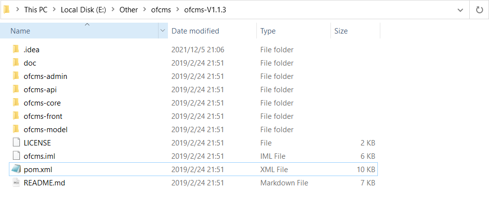

目录
- 环境搭建
- 代码审计
  - 漏洞分析
    - CVE-2019-9615 后台 SQL注入
    - CVE-2019-9610 后台 目录遍历


## 环境搭建
项目地址
- [https://gitee.com/oufu/ofcms/](https://gitee.com/oufu/ofcms/)

下载后解压，目录结构如下



右键pom.xml，用IDEA打开，然后等IDEA自动下载好需要的依赖包即可。


配置数据库

- 找到数据库配置文件，修改db-config.properties为db.properties（否则一直跳转到安装目录）

  ```bash
  # 修改前
  src/main/resources/dev/conf/db-config.properties
  # 修改后
  src/main/resources/dev/conf/db.properties
  ```

- 创建数据库

  ```sql
  create database ofcms;
  ```

- 初始化数据库

  

  选择对应版本导入，勾选ofcms数据库

  

  如图，即为导入成功

  

- 修改数据库配置文件

  


配置中间件-Tomcat

- 配置context,选择要部署的war包

  

- 配置端口等设置

  

- Run

  

如图，成功安装


（附：可能出现的问题）


至此，环境搭建过程结束。

## 代码审计

了解待审计的系统的介绍以及使用的技术栈


然后根据所用技术栈选择优先挖掘的漏洞类型

- jfinal的历史漏洞 & bypass
- Freemarker 模板注入漏洞
- spring的历史漏洞
- 以及非代码层面的问题
  - 组件默认口令：mysql & redis
  - 后台默认口令：admin/123456
  - 影子账户：数据库初始化时的用户表自动填充的账号
- . . .

### 漏洞分析

先看复现分析历史漏洞

- [https://cve.circl.lu/search](https://cve.circl.lu/search)


#### CVE-2019-9615 后台 SQL注入

漏洞描述


定位到漏洞点

- com.ofsoft.cms.admin.controller.system.SystemGenerateController#create


跟进方法getPara()

- com.jfinal.core.Controller#getPara()
  - 未作任何过滤


跟进方法update，到com.jfinal.plugin.activerecord.DbPro#update()建立数据库连接


跟进方法this.update();

- com.jfinal.plugin.activerecord.DbPro#update()


至此处理流程结束，漏洞产生的原因也很清晰：

- getPara 获取 sql 参数，然后传入update⽅法直接执⾏sql 语句，返回 json 格式的数据，其中

传⼊的参数sql未经任何的处理过滤就直接被执⾏。

update 型SQL注入漏洞(可利用报错回显数据)

payload

```sql
update of_cms_ad set ad_id = updatexml(1,concat(0x7e,(user())),0) where ad_id = 5
```

漏洞效果


#### CVE-2019-9610 后台 目录遍历

漏洞描述


定位到漏洞点

- com.ofsoft.cms.admin.controller.cms.TemplateController#getTemplates


通过方法getPara()获取参数

- dirName：dir
- upDirName：up_dir
- resPath：res_path

然后先对upDirName做了简单判断，目的是确定当前文件目录；

接着对resPath进行判断，创建名为pathFile的File实例，这里若选择res_path=res,则会进入

- com.ofsoft.cms.admin.controller.system.SystemUtile#getSiteTemplateResourcePath


回到之前的地方，通过getPara()获取参数file_name,判断文件是否存在


然后通过FileUtils.readString()读取文件内容


跟进

- com.ofsoft.cms.core.uitle.FileUtils#readString


读取文件，并把文件内容写入缓存，设置编码


这里敏感字符进行了替换，并使用setAttr方法保存变量fileContent & editFile。


最后通过render()方法进行渲染并返回给客户端。

至此处理流程结束，漏洞产生的原因也很清晰：

- getTemplates()对传⼊的参数dir未经任何的处理过滤，可使用../进行目录穿越，然后拼接同样未作处理的参数file_name达到任意文件读取的效果。

payload

```sql
/ofcms-admin/admin/cms/template/getTemplates.html?file_name=web.xml&dir=../../&dir_name=/
```

漏洞效果


