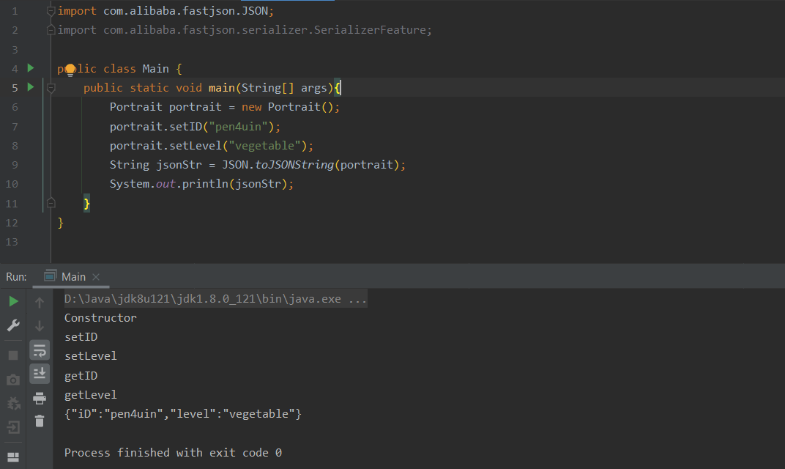
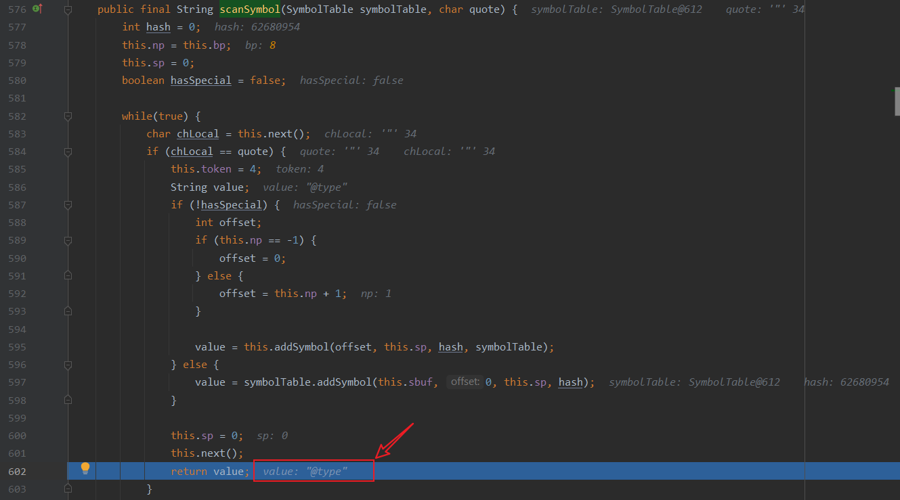
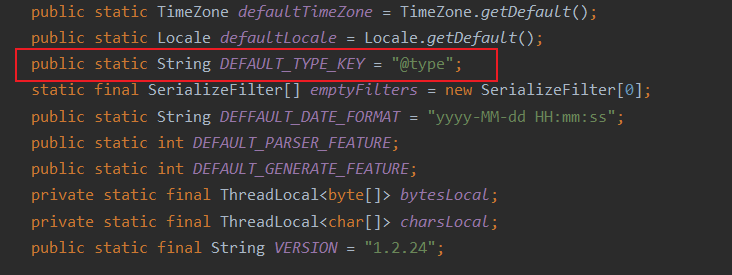
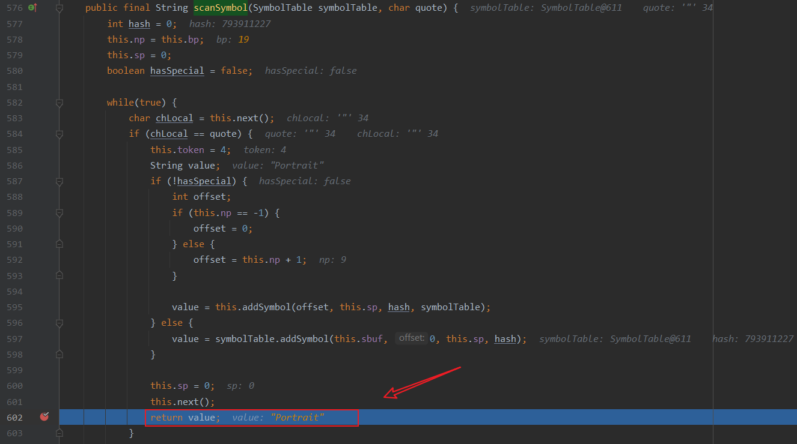
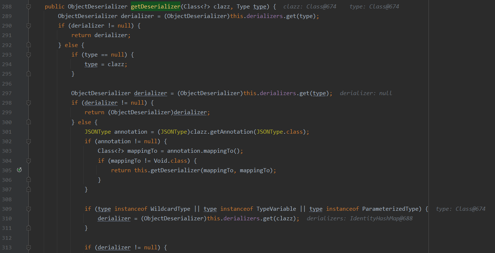
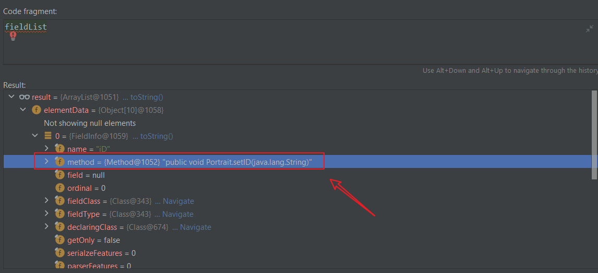
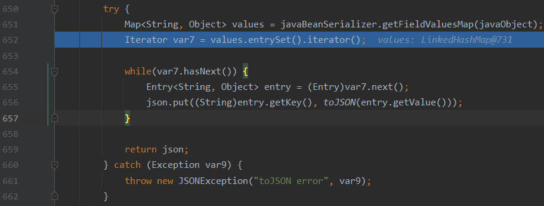
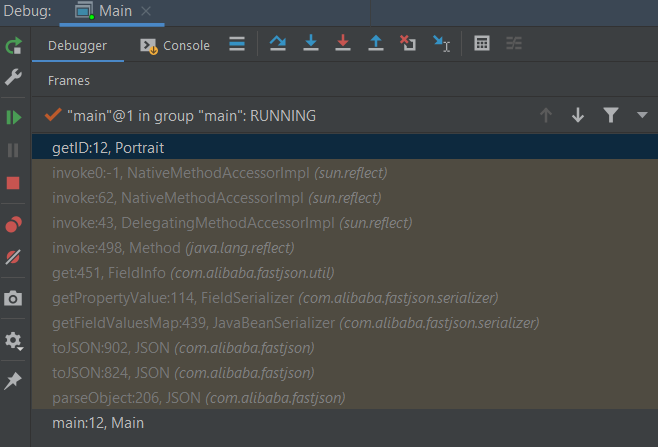
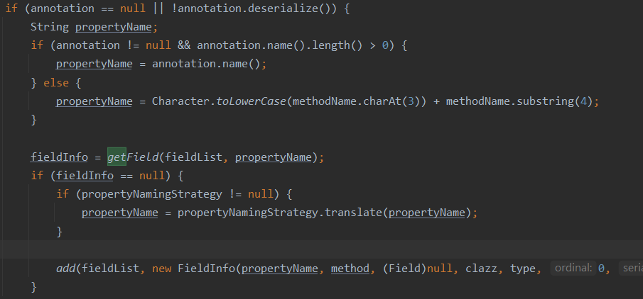

前置基础
---

Fastjson是一个Java语言编写的高性能功能完善的JSON库。 它采用一种“假定有序快速匹配”的算法，提升了JSON Parse的性能，是目前Java语言中最快的JSON库。 Fastjson接口简单易用，已经被广泛使用在缓存序列化、协议交互、Web输出、Android客户端等多种应用场景。


### Fastjson <= 1.2.24
#### 漏洞分析

##### 序列化

测试示例代码

- Portrait.java

```java
public class Portrait {
    private String id;
    private String level;

    public Portrait() {
        System.out.println("Constructor");
    }

    public String getID() {
        System.out.println("getID");
        return id;
    }

    public void setID(String id) {
        System.out.println("setID");
        this.id= id;
    }
    public String getLevel() {
        System.out.println("getLevel");
        return level;
    }

    public void setLevel(String level) {
        System.out.println("setLevel");
        this.level = level;
    }
}
```

- pom.xml

```xml
<dependency>
    <groupId>com.alibaba</groupId>
    <artifactId>fastjson</artifactId>
    <version>1.2.24</version>
</dependency>
```


###### JSON.toJSONString()

> SerializerFeature.WriteClassName是toJSONString的一个属性值，设置之后在序列化的时候会多写入一个@type，用于JSON被解析时的指定某个类。

###### with SerializerFeature.WriteClassName

```java
Portrait portrait = new Portrait();
portrait.setID("pen4uin");
portrait.setLevel("vegetable");
String jsonStr = JSON.toJSONString(portrait, SerializerFeature.WriteClassName);
System.out.println(jsonStr);
```


```
{"@type":"Portrait","iD":"pen4uin","level":"vegetable"}
```


###### without SerializerFeature.WriteClassName

```java
Portrait portrait = new Portrait();
portrait.setID("pen4uin");
portrait.setLevel("vegetable");
String jsonStr = JSON.toJSONString(portrait);
System.out.println(jsonStr);
```



```
{"iD":"pen4uin","level":"vegetable"}
```

##### 反序列化

##### JSON.parse()

```java
public class Main {
    public static void main(String[] args){
        String jsonStr = "{\"@type\":\"Portrait\",\"iD\":\"pen4uin\",\"level\":\"vegetable\"}";
        JSON.parse(jsonStr);
    }
}
```


开始debug

- com.alibaba.fastjson.parser.DefaultJSONParser#parse(java.lang.Object)

  词法分析

  

  此时`text`第一个字符的token为12(即`LBRACE，{`)，进入case 12

  

  跟进`DefaultJSONParser#parseObject()`

- com.alibaba.fastjson.parser.DefaultJSONParser#parseObject(java.util.Map, java.lang.Object)

  前3个判断条件均不满足

  

  执行到第3个else分支

  - 若满足条件：**{**之后的字符的ASCII码为34(即双引号，“)，则调用lexer.scanSymbol方法

  

  跟进lexer.scanSymbol

- com.alibaba.fastjson.parser.JSONLexerBase#scanSymbol(com.alibaba.fastjson.parser.SymbolTable, char)

  获取双引号里的内容，若字符为双引号(`chLocal`)，则跳出循环,获取到value为`@type`

  

  回到DefaultJSONParser#parseObject(，此时key==@type，继续跟进发现以下判断

  - key == JSON.DEFAULT_TYPE_KEY

    

  - 此时key==@type，条件满足，继续获取下一对双引号中的text(重复以上步骤)

  

  - 最终得到类名为`Portrait`的Class

    > {"@type":"Portrait","iD":"pen4uin","level":"vegetable"}

    

  跳出lexer.scanSymbol(，回到DefaultJSONParser#parseObject(，跟进`TypeUtils.loadClass()`

  

  

- com.alibaba.fastjson.util.TypeUtils#loadClass(java.lang.String, java.lang.ClassLoader)

  尝试从`ConcurrentMap<String, Class<?>> mappings`获取className为`Portrait`的class对象

  

  此时mappings自然不存在该class

  

  于是，经过3个判断后，执行到第3个else分支，首先进入第1个 `try...catch`，不满足条件`classLoder != null`

  

  进入第2个 `try...catch`，从当前线程获取classLoder，将clazz，即`Portrait`put到`mappings`

  

- 回到DefaultJSONParser#parseObject(

  满足条件：`clazz != null`

  

  执行流程来到

  

  跟进this.config.getDeserializer()

- com.alibaba.fastjson.parser.ParserConfig#getDeserializer(java.lang.reflect.Type)

  不满足条件：`derializer != null`

  

  执行流程进入第1个else if 分支，跟进this.getDeserializer((Class)type, type)

- com.alibaba.fastjson.parser.ParserConfig#getDeserializer(java.lang.Class<?>, java.lang.reflect.Type)

  据Class对象获取里面声明的Field,Method,Constructor

  

  经过多个条件：`derializer != null` 判断后，执行流程走到下面这里

  

  判断class对象是否在`denyList`中，该黑名单限制了可以进行反序列化的类，当前版本(v1.2.24)的fastjson只限制了java.lang.Thread。

  又经过多个 if...else的判断后走到下面，终于迎来了自己的derializer，即满足条件：`derializer != null` 

  

  跟进this.createJavaBeanDeserializer(

- com.alibaba.fastjson.parser.ParserConfig#createJavaBeanDeserializer

  ~~划重点了~~，这个方法很重要，因为开发者平时自己编写的类有一大部分都不继承jdk包含的类(除了Object)，而这个方法实现了这部分反序列化需求；其次，这个方法构建了普通类的反序列化框架(调用了其他更具体的方法)。

  

  验证asm开启状态，若没有开启asm，则会使用`JavaBeanDeserializer`进行反序列化转换

  

  由于fastjson默认开启asm， 于是执行流程执行到JavaBeanInfo.build，跟进

  

- com.alibaba.fastjson.util.JavaBeanInfo#build

  

  ~~（略）~~

  

  获取并保存目标Java类中的成员变量以及其对应的setter、getter方法，

  

  通过创建一个fieldList数组，来存放后续将要处理的目标类的 setter 方法及某些特定条件的 getter方法，如图所示(fieldList)

  

- 获取完对象后回到com.alibaba.fastjson.parser.DefaultJSONParser#parseObject()进行反序列化

  

- 如图，所有的set方法在反序列化的过程中都被调用了，但是get方法呢？

  


暂且可以得到以下结论：

- 在使用JSON.parse进行反序列化时，调用了目标类的构造方法和所有的setter方法，但是getter方法没被调用

#### JSON.parseObject()

同样的待反序列化字符串，用JSON.parseObject()进行反序列化

```java
public class Main {
    public static void main(String[] args){
        String jsonStr = "{\"@type\":\"Portrait\",\"iD\":\"pen4uin\",\"level\":\"vegetable\"}";
        JSON.parseObject(jsonStr);
    }
}
```

先来看结果


于是又可以得到以下结论：

- 在使用JSON.parseObject()进行反序列化时，调用了目标类的构造方法，setter方法和getter方法

那么问题来了：为什么会造成这种差异呢？[问题1]

继续debug

- com.alibaba.fastjson.JSON#parseObject(java.lang.String)

  发现JSON.parseObject其实就是调用JSON.parse()

  

  调用栈如下

  ```
  parse:1306, DefaultJSONParser (com.alibaba.fastjson.parser)
  parse:1293, DefaultJSONParser (com.alibaba.fastjson.parser)
  parse:137, JSON (com.alibaba.fastjson)
  parse:128, JSON (com.alibaba.fastjson)
  parseObject:201, JSON (com.alibaba.fastjson)
  main:12, Main
  ```

- com.alibaba.fastjson.parser.DefaultJSONParser#parse(java.lang.Object)

  ```
  具体debug过程参考JSON.parse()部分
  ```

- 既然执行流程如出一辙，那么产生差异的根本原因应该就是138行的toJSON()方法

  

  跟进

- com.alibaba.fastjson.JSON#toJSON(java.lang.Object)

  将返回的Java对象通过JSON.toJSON()转为 JSONObject对象

  

- com.alibaba.fastjson.JSON#toJSON(java.lang.Object, com.alibaba.fastjson.serializer.SerializeConfig)

  

  执行流程将会走到

  

  调用javaBeanSerializer.getFieldValuesMap()，跟进

- com.alibaba.fastjson.serializer.JavaBeanSerializer#getFieldValuesMap

  创建了map来记录目标类中所有getter方法

  

  调用了getter.getPropertyValue(object)，跟进

- com.alibaba.fastjson.serializer.FieldSerializer#getPropertyValue

  

  在102行调用this.fieldInfo.get(object)，跟进

- com.alibaba.fastjson.util.FieldInfo#get

  通过反射调用目标类中所有的getter方法

  

  调用栈如下

  

至此，`问题1（为什么会造成这种差异呢？）`成功解决。

那么问题又来了，使用JSON.parse()进行反序列化有机会调用目标类的getter方法吗？[问题2]

答案：有的。

当代码的执行流程走到JavaBeanInfo.build()时，有这样一段代码


其中若想成功执行到add()方法，首先需要满足以下条件

```java
# 方法名需要长于4
methodName.length() >= 4 
# 不是静态方法
&& !Modifier.isStatic(method.getModifiers()) 
# 以get字符串开头，形如getxxxx(xx,xx,...)
&& methodName.startsWith("get") 
# 第4个字符需要是大写字母，形如getXXX(xx,xx,..)
&& Character.isUpperCase(methodName.charAt(3)) 
# 无参，形如getXXX()
&& method.getParameterTypes().length == 0 
# 方法的返回类型的class对象的需要继承自以下类或实现了以下接口（满足其一即可）
&& (Collection.class.isAssignableFrom(method.getReturnType()) || Map.class.isAssignableFrom(method.getReturnType()) || AtomicBoolean.class == method.getReturnType() || AtomicInteger.class == method.getReturnType() || AtomicLong.class == method.getReturnType())) 
```

然后满足



所以若想使用JSON.parse()进行反序列化时调用到目标类的getter方法，只需要该方法满足以上条件即可。
